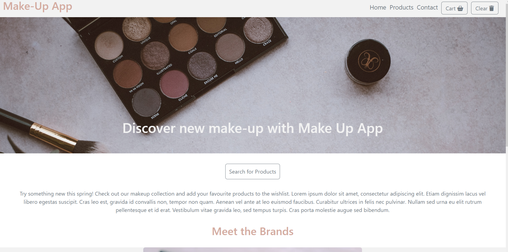
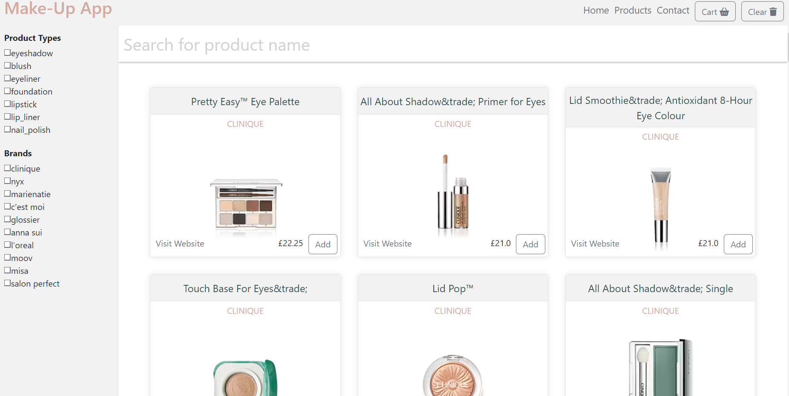

# Makeup App

## Description

This is a webpage where users can discover new makeup.
[View](https://discover-make-up.netlify.app)

## Installation

N/A

## Usage

Introducing our revolutionary make-up app that simplifies your beauty routine! With our app, you can easily select from a wide range of make-up items, including foundation, lipstick, eyeshadow, and more. Whether you're a beginner or a pro, our app offers a user-friendly interface that makes selecting the right make-up products a breeze. Say goodbye to endless trips to the store and hello to the ultimate make-up experience with our app! Click the buton "Search for products" and you will be redirected to the product display page. Here you can either filter the products by brand or type, or simply search by product name. If you would like to save the item to your favorites list, press the button "Add" next to the product image. The selected product will be added to the "Cart" which you can view by pressing the "Cart" button in the header. If you would like to clear the cart, press the "Clear" button in the header. To contact us, go to the Contact page and submit your inquiry.

## URL of Deployed Application
https://discover-make-up.netlify.app

## URL of Github repository that contains application code
https://github.com/eula-snow/makeup_app

## Technolgy

HTML, CSS, React.js, [Makeup API](http://makeup-api.herokuapp.com), React Bootstrap, GitHub, Netlify

## Credits

Ildiko Dutton, Mariia Konova, Nanda Nippani, Aurelia Stanculea

## License

Please refer to the LICENSE in the repo.
